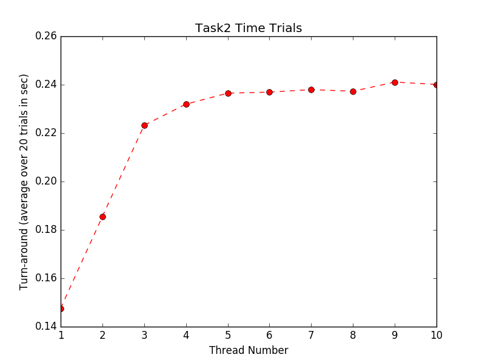

# Assignment 1

## Report (Task 2)

*How did you solve each challenge in task 2? Be specific, add pseudo code if you need to.*

1. To divide the computational load between multiple threads, we decided that our parent thread, main(), would open Python file objects for each file to be processed, store references to those file objects in an array, and pass a reference the file object array to each thread on initialization. Together, the threads address one file object at a time and individually take turns reading a line from the current file object. The threads then all begin at the first file reading a line at a time, processing that line, then updating their local histograms (word: frequency dictionaries) before reading another line. Regular expression processing was used to isolate words from lines. Once a file has been read, the thread that detected this removes the file object from the head of the list, and threads begin work on the next. Once the file object array is empty, threads add their personal data to the shared histogram, and then update a shared variable to indicate that they are now inactive.
2. To prevent two or more threads from processing the same part of any document, we use a simple semaphore to create a mutual exclusion lock around the array of file objects.
3. To write the output to a single file, the last running thread can recognize it's the last running thread using the shared "threads inactive" integer. When there are no more words to count and the thread is the last one running, it calls the write_to_file method which writes the shared histogram to an output file.

*Did you face any other challenges? How did you solve them?*

Detecting when all threads are idle (in this case that all words had been logged from the last lines of the last file) was the biggest block for us in the logic. We wanted to use a semaphore, since it would make sense to do so, but it also needed to be initialized to a negative value so that each thread could release when it terminated, and the last could acquire and write the histogram. This is not possible with Python's standard semaphors though, and we ended up getting the same functionality with a global variable. This solution might not be ideal as assignments get more intricate, but for assignmetn 1, it provided a quick solution without modifying Python's built-in functionality.

Figuring out how to govern threads' access to the files was also an important challenge. We wanted our threads to be working with as little data at a time as possible to let the scheduler have as much control as possible. Python's file objects came in handy here, allowing us to be sure no lines are read twice and that every line is recieved by a thread without much control code at all. In Java, explicit use of `yield` could be used to similar effect.

*Compare the running time of your code in task 1 to that of thread 2 with a single thread. Explain
your results.*

`task1.py`: ~0.19 s
`task2.py` (1 thread): ~0.25 s

Unlike Task1, Task2 bears the overhead burden of semaphores and the complete copying of the thread's local histogram into the shared histogram in the Task2. (The timings here are also somewhat dependant on what's running on my local computer.)

*Calculate the running time of task 2, using a varying number of threads. Start with a single
thread, and keep increasing the number of threads till the running time doesn’t change
(significantly). Create a plot to represent the varying running time with increased number of threads. Explain
your results.*

Using multiple threads in Python actually didn't end up helping the overall processing time of the files. In fact, the time required to schedule multiple threads is quite substantial (notice the 70% increase in time taken as thread count varies from 1 to 10). We believe that this is because Python only runs in *one process* using it's own scheduler, so the operating system scheduler cannot distribute the threads to the multiple cores in a machine. In essence, we have demonstrated multi-threading here, but not multiprocessing. 

